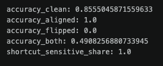
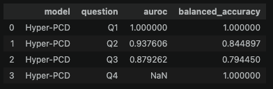
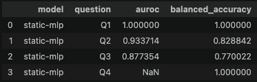
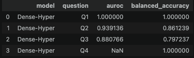
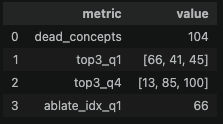

# Shortcut Analysis and Hyper-PCD

## Main model quality

The main model definitely learned the shortcut

## Results of Hyper-PCD and the baselines on Q1-Q4

- There is only a slight difference between results of different models
- Judging by auroc, Dense-Hyper is the best model, Hyper-PCD is second, and static-mlp is last.
- Hidden states make Q1 trivially recoverable
- Hidden states also allow good prediction of Q2 and Q3.
- For Q4 auroc is `NaN` because of `shortcut_sensitive = 1`

### Hyper-PCD

### static-mlp

### Dense-Hyper

So, from the hidden state it is possible to predict both hint presence, hint conflict with the label and even main-model errors.

## Hyper-PCD diagnostics + ablation:

The model uses only a relatively small subset of the 128 concepts. 104 concepts are dead. Maybe due to overtraining or something similar to 'routing collapse'.

## Effect of ablating the concept most associated with Q1

- The quality drops slightly
- This means the hint-related information is partially localized in that concept, but  is not stored only there; the representation is distributed.
